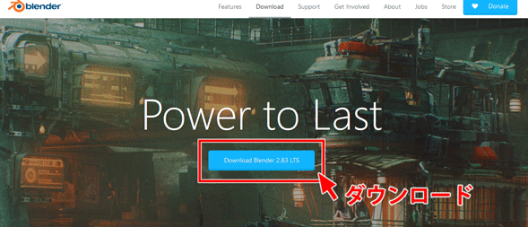
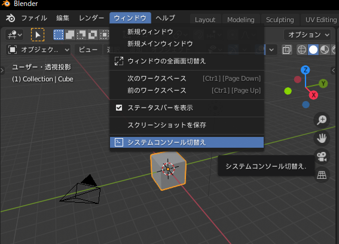
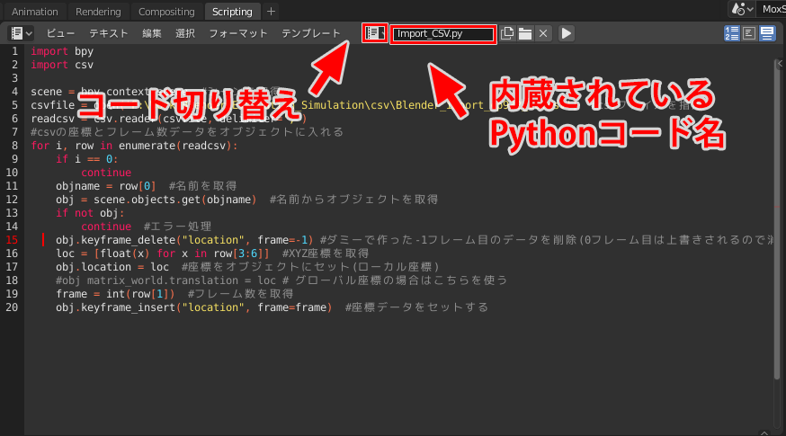
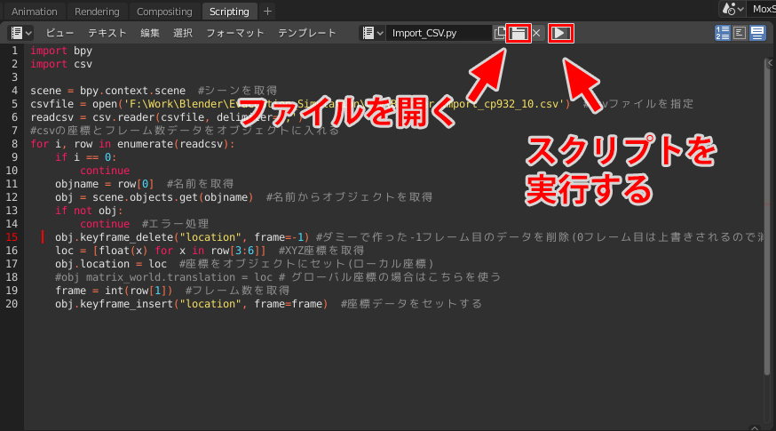

# Blender導入手順

## 目次

<!-- TOC -->
- [インストール](#%E3%82%A4%E3%83%B3%E3%82%B9%E3%83%88%E3%83%BC%E3%83%AB)
- [Blenderの日本語化](#blender%E3%81%AE%E6%97%A5%E6%9C%AC%E8%AA%9E%E5%8C%96)
- [コンソールの出し方、コンソールの日本語化](#%E3%82%B3%E3%83%B3%E3%82%BD%E3%83%BC%E3%83%AB%E3%81%AE%E5%87%BA%E3%81%97%E6%96%B9%E3%82%B3%E3%83%B3%E3%82%BD%E3%83%BC%E3%83%AB%E3%81%AE%E6%97%A5%E6%9C%AC%E8%AA%9E%E5%8C%96)
- [提供したBlenderファイルを開く](#%E6%8F%90%E4%BE%9B%E3%81%97%E3%81%9Fblender%E3%83%95%E3%82%A1%E3%82%A4%E3%83%AB%E3%82%92%E9%96%8B%E3%81%8F)
- [スクリプトを実行する](#%E3%82%B9%E3%82%AF%E3%83%AA%E3%83%97%E3%83%88%E3%82%92%E5%AE%9F%E8%A1%8C%E3%81%99%E3%82%8B)
- [Tips](#tips)

<!-- /TOC -->
## インストール

  
<https://www.blender.org/download/releases/2-83/>

上記リンクからBlender2.83LTSをインストール  
最新バージョンは2.9だが互換性を保つためにこのバージョンでインストールしてください  

## Blenderの日本語化

BlenderはUI等が英語表記になっていますが、  
日本語に変更もできます(英語のままでも問題ありません)  
変更方法は[こちらのページ](https://baku-blog.com/blender-japanese/)を参照してください

## コンソールの出し方、コンソールの日本語化

スクリプトを実行した結果を表示できる**システムコンソール**があります

- 表示方法(Windows)  
**ウインドウ-システムコンソール切り替え**で表示できます  
  
- 表示方法(Mac)  
[こちら](http://dekapoppo.blogspot.com/2017/12/mac-blenderprint.html)を参照してください  

システムコンソールは文字コードの関係？で、UIを日本語にしていた場合文字化けします  
バッチファイルからBlenderを起動することで解消できます  
下記はバッチファイルのコードです

```
@echo off
rem 文字コードをUTF-8に設定
chcp 65001

rem バッチファイルから起動した場合
@if "%1"=="" (
D:
cd "C:"/"Program Files"/"Blender Foundation"/"Blender 2.83"
blender.exe
)

rem バッチファイルにBlenderファイルをドラッグ＆ドロップした場合
set search=%~x1
set blend=.blend

@if %search%==%blend% (
%1
)
```

`"C:"/"Program Files"/"Blender Foundation"/"Blender 2.83"`を、  
自分のblender.exeのあるディレクトリのパスに変更してください  

## 提供したBlenderファイルを開く

Slackに上げたBlenderファイルを開いてください  

## スクリプトを実行する

避難シミュレーションをするのに必要なpythonスクリプトは提供したBlenderファイルに内蔵されています  
スクリプトファイルを読み込む必要はありません  
pythonスクリプトは3つあり、Import_CSVとInstance_Characterの2つを使用します  
下記画像のようにコードを切り替えられます  

下記のボタンでスクリプトを実行します  

僕の[GitHub](https://github.com/SKawahara1/Evacuation_Simulation)にpythonスクリプトのオリジナルがあり、コードを更新するときはファイルをダウンロードして開いてください

### スクリプト｜Instance_Character

レイアウト選択でScript
生成する数を指定し、Instance_Character実行
コンソールで進行状況を確認
指定回数生成できたことを確認

### スクリプト｜Import_CSV

csvを開き、"Cube"を"Character"に置換、ShiftJSで保存
Import_CSVで先のcsvファイルのパスを指定して実行
下の方にキーフレームが現れれば成功
Spaceキーでアニメーションを開始する

## Tips

### 視点操作方法、平行投影方法

### アニメーションを最初から開始する

### 上のタブの意味

### スクリプトの更新方法

**layout/theme.liquid**の<head>タグ内にFontリンクを貼る

**assets/theme.scss.liquid** のプロパティ

- \$font-stack-header
- \$font-stack-body
- \$font-stack-cart-notification

でフォント値を**Noto Sans JP**と**sans-serif**にする
sans-serifのところ表示不可を回避するためのセーフフォントであれば何でも良い

# スライドバーの幅を伸ばす

CSSのGrid Layoutを使ってページ幅を分割し、レイアウトしている
この比率を変えてやれば幅を伸ばせる

**theme.scss.liquid**の1292行目～でクラスが定義されてる

```scss
  .#{$grid-breakpoint-type}one-third { width: percentage(1 / 3); }
  .#{$grid-breakpoint-type}two-thirds { width: percentage(2 / 3); }
```

<!--  -->
テーマ設定→色

&darr;

<!--  -->
フォームフィールドの背景

**フォームの枠線**は、

#### assets/theme.scss.liquid 2639-2650line

```css
.form-vertical {
  input,
  select,
  textarea {
    display: block;
    margin-bottom: $padding-form;
    min-width: 300px;

    @include media-query($small) {
      width: 100%;
    }
  }
```

`min-width:300px;`の下の行に`border: 1px solid #000;`を挿入すれば枠線が表示される
枠線のスタイルを変更したいときは[こちら](https://techacademy.jp/magazine/8626)を参照

# 住所入力フォーム(テキスト入力タイプ)にグレー文字の初期値を設定する

htmlのinput要素にplaceholder属性を追加すると初期値を設定できる [こちらを参照](https://weback.net/htmlcss/1284/)
**注意:** placeholderで初期値を設定できるのはテキスト入力の項目のみで、都道府県項目のように選択タイプだと設定できない
選択タイプの設定方法は次に説明する

#### templates/customers/address.liquid 19-89line

```html
<div id="AddressNewForm" class="form-address form-vertical hide">


</div>
```

の所を以下のコードに置き換えれば設定できる

`selectInitialProvince('Kyōto');`で引数に京都を設定し、実行する  
`Kyoto`ではなく`Kyōto`なことに注意  

# 住所入力フィールドのラベルを変更する

#### locales/ja.json 153-154line

```json
  "address1": "住所",
  "address2": "住所",
```

を

```json
  "address1": "地名\/番地",
  "address2": "建物名\/部屋番号",
```

に変更する  
`"地名\/番地",`の`\`はjsonファイルにおける[/(スラッシュ)文字のエスケープ処理](https://www.ipentec.com/document/json-character-escape)
