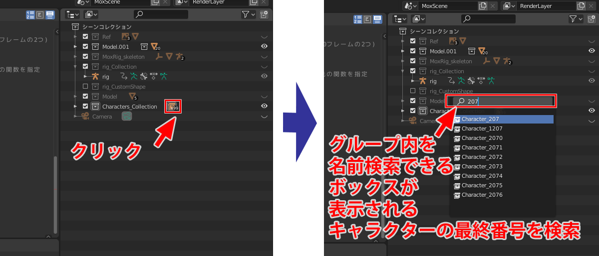

# Blender導入手順

## 目次

<!-- TOC -->
- [インストール](#%E3%82%A4%E3%83%B3%E3%82%B9%E3%83%88%E3%83%BC%E3%83%AB)
- [Blenderの日本語化](#blender%E3%81%AE%E6%97%A5%E6%9C%AC%E8%AA%9E%E5%8C%96)
- [コンソールの出し方、コンソールの日本語化](#%E3%82%B3%E3%83%B3%E3%82%BD%E3%83%BC%E3%83%AB%E3%81%AE%E5%87%BA%E3%81%97%E6%96%B9%E3%82%B3%E3%83%B3%E3%82%BD%E3%83%BC%E3%83%AB%E3%81%AE%E6%97%A5%E6%9C%AC%E8%AA%9E%E5%8C%96)
- [提供したBlenderファイルを開く](#%E6%8F%90%E4%BE%9B%E3%81%97%E3%81%9Fblender%E3%83%95%E3%82%A1%E3%82%A4%E3%83%AB%E3%82%92%E9%96%8B%E3%81%8F)
- [スクリプトを実行する](#%E3%82%B9%E3%82%AF%E3%83%AA%E3%83%97%E3%83%88%E3%82%92%E5%AE%9F%E8%A1%8C%E3%81%99%E3%82%8B)
- [Tips](#tips)

<!-- /TOC -->
## インストール

  
<https://www.blender.org/download/releases/2-83/>

上記リンクからBlender2.83LTSをインストール  
最新バージョンは2.9だが互換性を保つためにこのバージョンでインストールしてください  

## Blenderの日本語化

BlenderはUI等が英語表記になっていますが、  
日本語に変更もできます(英語のままでも問題ありません)  
変更方法は[こちらのページ](https://baku-blog.com/blender-japanese/)を参照してください

## コンソールの出し方、コンソールの日本語化

スクリプトを実行した結果を表示できる**システムコンソール**があります

- 表示方法(Windows)  
**ウインドウ-システムコンソール切り替え**で表示できます  
  
- 表示方法(Mac)  
[こちら](http://dekapoppo.blogspot.com/2017/12/mac-blenderprint.html)を参照してください  

システムコンソールは文字コードの関係？で、UIを日本語にしていた場合文字化けします  
バッチファイルからBlenderを起動することで解消できます  
下記はバッチファイルのコードです

```
@echo off
rem 文字コードをUTF-8に設定
chcp 65001

rem バッチファイルから起動した場合
@if "%1"=="" (
D:
cd "C:"/"Program Files"/"Blender Foundation"/"Blender 2.83"
blender.exe
)

rem バッチファイルにBlenderファイルをドラッグ＆ドロップした場合
set search=%~x1
set blend=.blend

@if %search%==%blend% (
%1
)
```

`"C:"/"Program Files"/"Blender Foundation"/"Blender 2.83"`を、  
自分のblender.exeのあるディレクトリのパスに変更してください  

## 提供したBlenderファイルを開く

Slackに上げたBlenderファイルを開いてください  

## スクリプトを実行する

レイアウト選択でScriptタブを選ぶと、スクリプト実行用のUIに切り替わります
  
<br>
避難シミュレーションをするのに必要なpythonスクリプトは提供したBlenderファイルに内蔵されています  
**スクリプトファイルを読み込む必要はありません**  

pythonスクリプトは3つあり、**Import_CSV**と**Instance_Character**の2つを使用します  

下記画像のようにコードを切り替えられます  

  
<br>  
下記のボタンでスクリプトを実行します  
僕の[GitHub](https://github.com/SKawahara1/Evacuation_Simulation)にpythonスクリプトのオリジナルがあり、  
コードを更新するときはGitHubからファイルをダウンロードして開いてください


### スクリプト｜Instance_Character

CSVファイルをインポートする元となるキャラクターを生成します

- **生成する数を指定し、Instance_Character実行**
  

- **コンソールで進行状況を確認**  
生成数が多いと時間がかかります  
この間はBlenderを操作しないでください(フリーズする場合があります)  
システムコンソールで進行状況を確認できます  
  

プログレスバーが100%になると生成完了です  
以下のように指定数分生成できたことを確認してください  
  
<br>
  

### スクリプト｜Import_CSV

- **csvファイルをエディタで開く**  
"Cube"を"Character"に全置換、文字コードShiftJSで保存  

- **Import_CSVでcsvファイルのパスを指定して実行**  
下記のようにImport_CSVスクリプトを実行してください  
  

マウスカーソルが読込中の表示になり、読み込みが完了したら成功です

- **Spaceキー**でアニメーションを開始できます

## Tips

### 視点操作方法、平行投影方法

[こちら](https://vtuberkaibougaku.site/2020/08/18/blender-viewpoint/)を参照してください  
`テンキー５`でパースを透視/平行に切り替えられます

### アニメーションを最初から開始する

`Shift+矢印キー←`でアニメーションを最初から開始できます

### 上のタブの意味

上にあるタブでBlenderの機能にあったUIに切り替えられます  
アニメーションの確認はLayoutタブが向いています  

  
